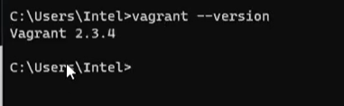

# step1: install oraclevm 

# step2: install vagrant in the windows system

To get know vagrant installed or not in the system 

# step3: create a new folder create a vagrant file in it  intialise that vagrant inside that foler 

    # vagrant init 
        ( iy will create a setup for vagrant)
then perform vagrant up then automatically instances will be created in the oarclecm
    # vagrant up
Now system will created in the vm to connect them 
username is: vagrant 
password is vagrant

    # vagrant destroy 
        ( it will delete all machines in current loaction machines )
    