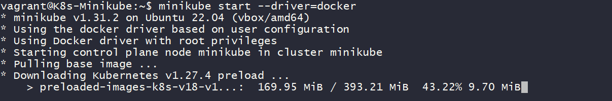
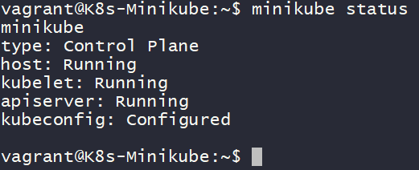
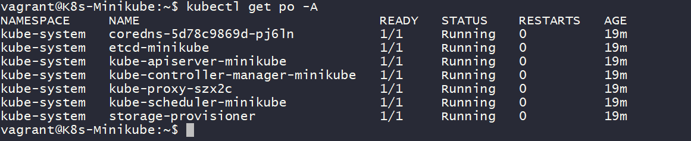
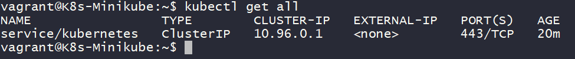

step1: After complete the machine up run below commands to create k8s-minikube cluster

step2: below commad will add current vagrant user added into docker group for to run docker related commands
	
	$ sudo usermod -aG docker $USER && newgrp docker

step3: below command will used to attach docker as a driver for minikube cluster
	
	$ minikube start --driver=docker 

# To verify minikube setup or not excute below commands 
	
	$ minikube status
	$ kubectl get po -A
	$ kubectl get all

